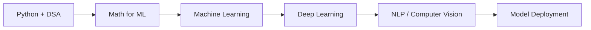

<h1 align="center">Hi 👋, I'm Abdul Qadir Ashraf</h1>
<h3 align="center">MCA Student at IIT Patna | AI & Machine Learning | Data Analyst / Technical Head</h3>

  <em>Python-focused developer exploring AI, machine learning, data science, and practical software systems.</em>

---

## 🚀 About Me

- 🎓 Pursuing **Master of Computer Applications (MCA) in AI and Machine Learning** at **Indian Institute of Technology, Patna**
- 💼 Working as **Technical Head at Destiny IT Services**
- 📍 Based in **Patna, Bihar, India**
- 🐍 Passionate about **Python Development**, with interests across **Data Science, Django, and AI/ML applications**
- 📊 Skilled in **Data Analysis, Microsoft Excel, Microsoft Office, Project Management, and Communication**
- 🎯 Goal: grow into a strong **AI/ML Engineer** who builds practical, scalable, and impactful solutions

---

## 💼 Professional Experience

### Technical Head — Destiny IT Services
**Apr 2022 – Present | Patna, Bihar, India**

- Working in a technical leadership role across data, productivity tools, and project execution
- Applying skills in **Data Analysis**, **Microsoft Excel**, **Microsoft Office**, and **Project Management**

### Tutor — Self
**Jan 2019 – May 2023**

- Helped learners build academic and technical foundations through structured guidance

---

## 🎓 Education

- **Indian Institute of Technology, Patna**  
  Master of Computer Applications - **AI and Machine Learning**  
  **Nov 2025 – Jan 2027**

- **Indira Gandhi National Open University**  
  Bachelor of Computer Applications - **Computer Science**  
  **Feb 2022 – Feb 2025**

---

## 🛠️ Tech Stack

### Languages

### AI / Data Science

### Frameworks & Tools

---

## 📌 Project Focus

- 🧠 **Machine Learning** — classification, regression, clustering, and model evaluation
- 📊 **Data Analysis** — cleaning, analysis, reporting, and insight generation
- 🌐 **Django Applications** — Python-backed web applications and dashboards
- 🗣️ **NLP Applications** — text classification, sentiment analysis, summarization, and chatbots
- 👁️ **Computer Vision** — image classification, detection, and real-time AI apps
- 🚀 **Model Deployment** — turning notebooks and models into usable applications

---

## 📈 GitHub Stats

  
  

  

---

## 🧭 Current Learning Path

---

## 🤝 Connect With Me

  

---

  <strong>“Learning AI is not just about models — it is about building systems that understand, assist, and create value.”</strong>

