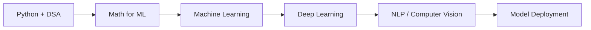

<h1 align="center">Hi 👋, I'm Qadir</h1>
<h3 align="center">MCA Student at IIT Patna | AI & Machine Learning Enthusiast</h3>

  <em>Building intelligent systems, learning deeply, and turning ideas into useful AI-powered projects.</em>

---

## 🚀 About Me

- 🎓 Pursuing **MCA from IIT Patna**
- 🤖 Focused on **Artificial Intelligence, Machine Learning, and Data Science**
- 💡 Interested in building projects around **ML models, NLP, Computer Vision, and AI applications**
- 🧠 Currently strengthening my foundations in **Python, DSA, mathematics for ML, and real-world model deployment**
- 🌱 Always exploring better ways to combine **software engineering + machine learning**
- 🎯 Goal: become a strong **AI/ML Engineer** who builds practical, scalable, and impactful solutions

---

## 🛠️ Tech Stack

### Languages

### AI / ML

### Tools & Platforms

---

## 📌 Featured Project Ideas

Here are the kinds of projects I am working on and planning to build:

- 🧠 **Machine Learning Projects** — classification, regression, clustering, and model evaluation
- 🗣️ **NLP Applications** — text classification, summarization, sentiment analysis, and chatbots
- 👁️ **Computer Vision Projects** — image classification, detection, and real-time vision apps
- 📊 **Data Science Dashboards** — data cleaning, visualization, and insight generation
- 🚀 **AI-Powered Web Apps** — deploying ML models with simple, useful interfaces

---

## 📈 GitHub Stats

  
  

  

---

## 🧭 Current Learning Path

---

## 🤝 Connect With Me

  
  

---

  <strong>“Learning AI is not just about models — it is about building systems that understand, assist, and create value.”</strong>

