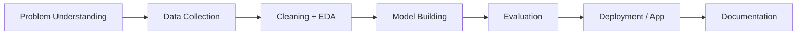

<h1 align="center">Hi 👋, I'm Abdul Qadir Ashraf</h1>
<h3 align="center">MCA Student at IIT Patna | AI & Machine Learning | Data Analysis | Python Development</h3>

  
  

  <em>Python-focused developer building toward AI/ML engineering through data analysis, machine learning, Django, and practical automation projects.</em>

---

## 🚀 Professional Snapshot

- 🎓 Pursuing **MCA in AI and Machine Learning** at **Indian Institute of Technology, Patna**
- 💼 Working as **Technical Head at Destiny IT Services**
- 📍 Based in **Patna, Bihar, India**
- 🐍 Strong interest in **Python Development**, **Data Science**, **Django**, and **AI/ML applications**
- 📊 Practical skills in **Data Analysis**, **Microsoft Excel**, **Microsoft Office**, **Project Management**, and **Communication**
- 🎯 Career direction: **AI/ML Engineer** focused on useful, deployable, real-world intelligent systems

---

## 🧠 What I Build

I am shaping my GitHub around projects that show the complete data-science workflow:

---

## 📌 Portfolio Highlights

| Project | Focus Area | What It Shows |
| --- | --- | --- |
| [Student Performance Prediction ML App](https://github.com/Abdul-Qadir-Ashraf/Student-Performance-Prediction) | ML Regression, Experiment Design | Cross-validation, model comparison, residual analysis, feature importance, and Streamlit prediction dashboard |
| [Fake News Detection Using NLP](https://github.com/Abdul-Qadir-Ashraf/Fake-News-Detection-NLP) | NLP, Model Evaluation | TF-IDF pipeline, model comparison, confusion matrix, error analysis, feature explanations, and Streamlit app |
| [Face Recognition Attendance System 2.0](https://github.com/Abdul-Qadir-Ashraf/Face-recognition-model) | Computer Vision, Python | Portfolio-grade face comparison and webcam attendance workflow |
| [Virtual Assistant](https://github.com/Abdul-Qadir-Ashraf/Virtual-assistant) | Python Automation | Assistant-style interaction and basic task execution |
| [Web Scrapper](https://github.com/Abdul-Qadir-Ashraf/Web-scrapper) | Data Collection | Web data extraction foundation for analytics projects |
| [Restaurant Invoice Creator and Calculator](https://github.com/Abdul-Qadir-Ashraf/Restaurant-invoice-creater-and-calculator) | Python Applications | Billing logic, calculation flow, and user-facing utility |

---

## 🧰 Core Skills

### Data Science & AI

### Software & Tools

### Programming Foundations

---

## 💼 Professional Experience

### Technical Head — Destiny IT Services
**Apr 2022 – Present | Patna, Bihar, India**

- Lead technical work involving data, productivity tools, and project execution
- Apply **Data Analysis**, **Microsoft Excel**, **Microsoft Office**, and **Project Management** in real operational contexts
- Build a bridge between technical problem-solving, team coordination, and practical delivery

### Tutor — Self
**Jan 2019 – May 2023**

- Guided learners through academic and technical subjects
- Strengthened communication, explanation, and mentoring skills

---

## 🎓 Education

- **Indian Institute of Technology, Patna**  
  Master of Computer Applications - **AI and Machine Learning**  
  **Nov 2025 – Jan 2027**

- **Indira Gandhi National Open University**  
  Bachelor of Computer Applications - **Computer Science**  
  **Feb 2022 – Feb 2025**

---

## 🧪 Data Science Project Roadmap

I am actively improving this profile with projects that demonstrate job-ready AI/ML skills:

- 📊 **Exploratory Data Analysis Portfolio** — clean datasets, visual insights, and business conclusions
- 🤖 **End-to-End ML Research Upgrade** — expand Student Performance Prediction with larger data, SHAP explainability, and fairness checks
- 🗣️ **NLP Research Upgrade** — extend Fake News Detection with larger datasets, transformer baselines, and source-credibility signals
- 👁️ **Computer Vision Upgrade** — add screenshots, evaluation examples, and optional Streamlit/Django UI to Face Recognition 2.0
- 🌐 **Django + ML App** — web interface connected to a trained model

---

## 📈 GitHub Stats

  
  

  

---

## 🎯 Current Focus

- Strengthening **Python, DSA, statistics, linear algebra, and machine learning fundamentals**
- Building stronger **project documentation** with problem statements, datasets, methods, results, and next steps
- Moving from simple scripts to **portfolio-grade AI/ML applications**
- Learning how to deploy models and present projects clearly for recruiters and collaborators

---

  <strong>“Great AI projects are not just trained — they are explained, tested, deployed, and useful.”</strong>

